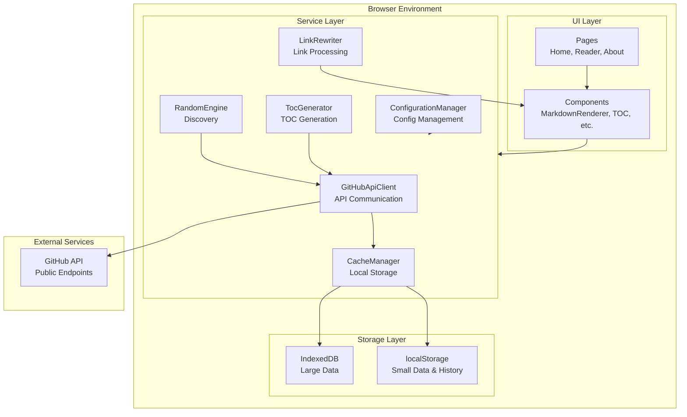
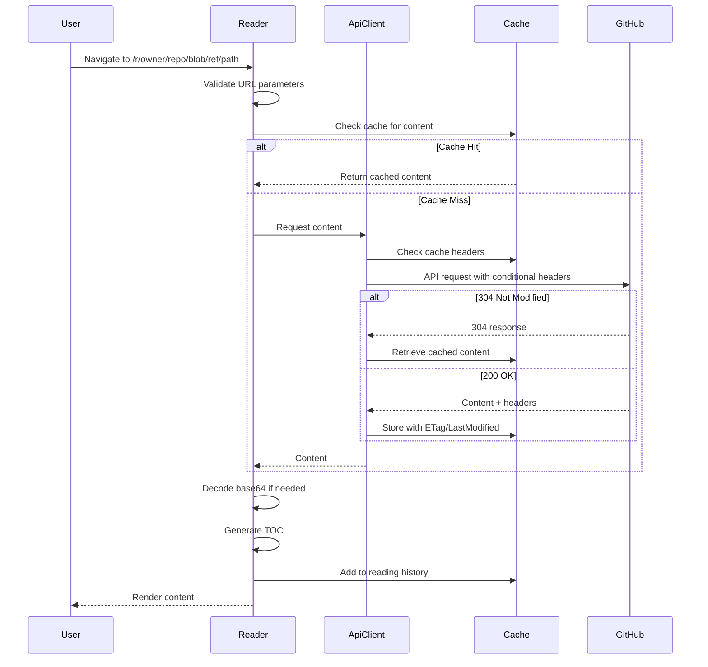
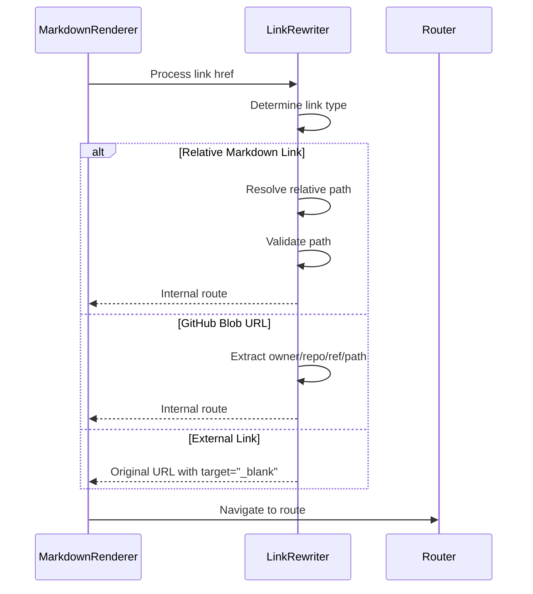
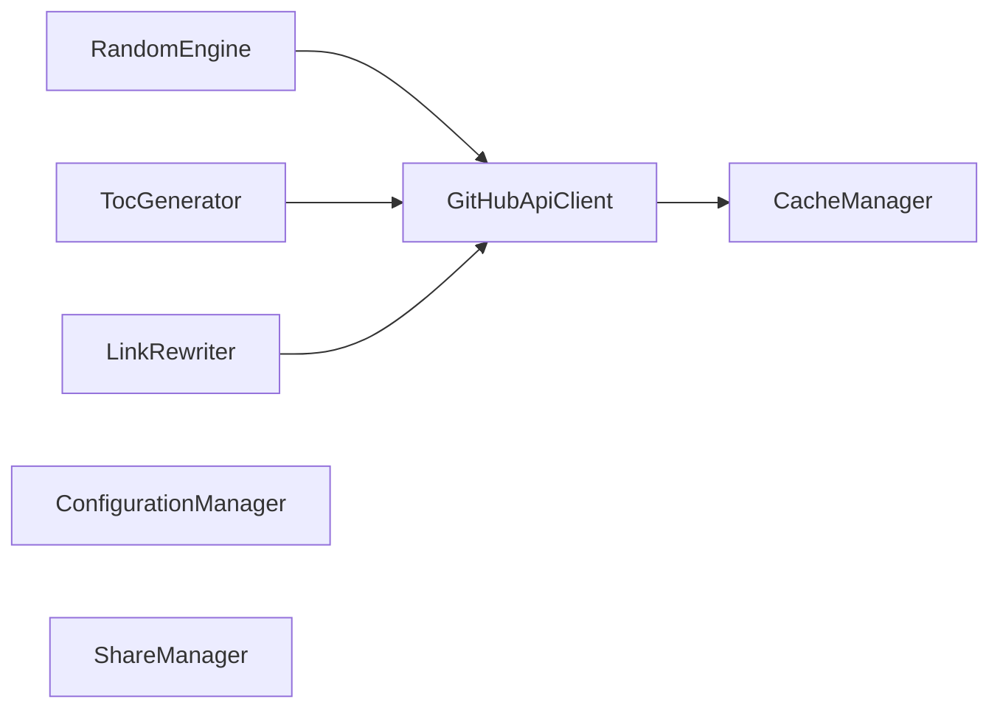
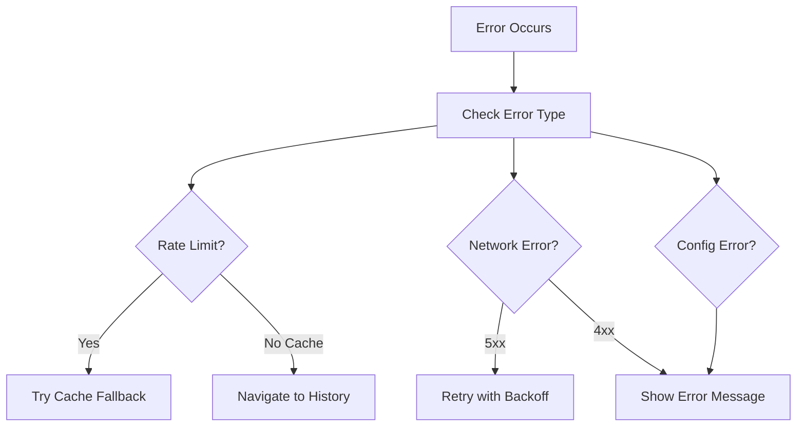

# System Architecture

## Architecture Overview

Alexandria follows a client-side architecture pattern with clear separation between presentation, business logic, and data access layers. The system is designed as a single-page application (SPA) that communicates directly with GitHub's public API.

## Technology Stack

### Core Technologies

- **React 19.2.3**: UI framework for component-based architecture
- **TypeScript 5.9.3**: Type-safe development with comprehensive type definitions
- **Vite 7.3.0**: Build tool providing fast HMR and optimized production builds
- **React Router DOM 7.11.0**: Client-side routing with dynamic basename support

### Markdown Processing

- **react-markdown 10.1.0**: Core markdown rendering engine
- **remark-gfm 4.0.1**: GitHub Flavored Markdown support
- **rehype-highlight 7.0.2**: Syntax highlighting for code blocks
- **rehype-sanitize 6.0.0**: HTML sanitization for security
- **rehype-raw 7.0.0**: Raw HTML processing (sanitized)

## System Architecture Diagram



## Directory Structure

```
src/
├── components/          # Reusable React components
│   ├── Breadcrumb/
│   ├── DocumentToc/
│   ├── ErrorDisplay/
│   ├── Footer/
│   ├── Header/
│   ├── Layout/
│   ├── MarkdownRenderer/
│   ├── NavigationHistory/
│   ├── RateLimitBanner/
│   ├── RateLimitWarning/
│   └── RepositoryToc/
├── pages/               # Page-level components
│   ├── About/
│   ├── Home/
│   └── Reader/
├── services/            # Business logic layer
│   ├── CacheManager.ts
│   ├── ConfigurationManager.ts
│   ├── GitHubApiClient.ts
│   ├── LinkRewriter.ts
│   ├── RandomEngine.ts
│   ├── ShareManager.ts
│   └── TocGenerator.ts
├── types/               # TypeScript type definitions
│   ├── ConfigurationError.ts
│   └── index.ts
└── utils/               # Utility functions
    ├── base64Decoder.ts
    ├── errorUtils.ts
    └── validationUtils.ts
```

## Data Flow

### Content Loading Flow



### Link Rewriting Flow



## Service Layer Architecture

### Service Dependencies



### Service Responsibilities

**GitHubApiClient**: Handles all GitHub API communication, rate limit management, and request retry logic.

**CacheManager**: Manages local storage (IndexedDB and localStorage), reading history, and cache headers for conditional requests.

**RandomEngine**: Implements random repository and content discovery algorithms.

**LinkRewriter**: Transforms markdown links into internal navigation routes.

**TocGenerator**: Generates table of contents for documents and repositories.

**ConfigurationManager**: Manages environment-based configuration with validation.

**ShareManager**: Handles content sharing via Web Share API and clipboard fallback.

## Routing Architecture

### Route Structure

- `/` - Home page (displays default repository README)
- `/r/:owner/:repo` - Repository view (displays repository README)
- `/r/:owner/:repo/blob/:ref/*` - File view (displays specific markdown file)
- `/about` - About page

### Dynamic Basename

The application detects the deployment environment and adjusts the router basename accordingly:

- **Development**: Empty basename (`/`)
- **GitHub Pages**: `/alexandria` basename
- **Custom domain**: Empty basename

### 404 Handling

GitHub Pages requires a `404.html` file that redirects to the SPA. The application detects these redirects and converts them to proper routes.

## State Management

### Component State

Each component manages its own local state using React hooks. No global state management library is used, keeping the architecture simple.

### Persistent State

- **Cache**: Stored in IndexedDB and localStorage
- **Reading History**: Stored in localStorage (last 50 items)
- **Rate Limit State**: Managed in memory by GitHubApiClient

### State Flow

State flows unidirectionally:
1. User interaction triggers component event
2. Component calls service method
3. Service updates cache/storage
4. Component re-renders with new data

## Error Handling Architecture

### Error Types

1. **RateLimitError**: Primary rate limit exceeded
2. **SecondaryRateLimitError**: Secondary rate limit with retry-after
3. **NetworkError**: Network failures and HTTP errors
4. **ConfigurationError**: Invalid configuration

### Error Flow



## Security Architecture

### Input Validation

All user input is validated before processing:
- URL parameters validated against GitHub naming rules
- Paths sanitized to prevent traversal attacks
- Repository identifiers validated for format compliance

### Content Sanitization

Markdown content is sanitized using rehype-sanitize with:
- Whitelist of allowed HTML tags
- Restricted attributes per tag
- Protocol whitelist for links and images
- No script execution capability

### Rate Limit Protection

The system protects against rate limit exhaustion through:
- Cache-first strategy
- Automatic fallback to cached content
- User warnings when rate limited
- Navigation to cached content when possible

## Performance Optimizations

### Caching Strategy

- **API Responses**: 6-hour TTL with ETag/LastModified support
- **Small Data**: localStorage (< 100KB)
- **Large Data**: IndexedDB (> 100KB)
- **Conditional Requests**: 304 Not Modified support

### Code Splitting

Vite automatically code-splits the application, loading components on demand.

### Lazy Loading

Components are loaded as needed through React Router's lazy loading capabilities.

## Design Decisions

### Why No Global State Management

The application's state needs are simple enough that React's built-in state management is sufficient. This reduces complexity and bundle size.

### Why IndexedDB + localStorage

Hybrid storage allows optimal performance:
- Fast access for small items (localStorage)
- Large capacity for big responses (IndexedDB)
- Persistent storage across sessions

### Why Client-Side Only

Eliminates server costs, simplifies deployment, and ensures user privacy by keeping all processing client-side.

### Why TypeScript

Type safety catches errors at compile time, improves developer experience, and serves as inline documentation.

